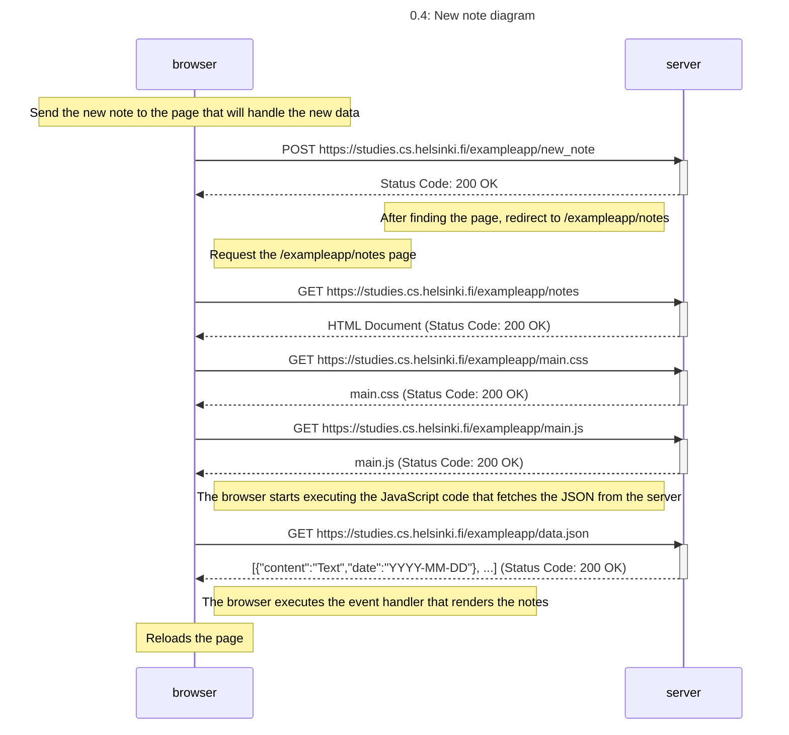

```mermaid
sequenceDiagram
    Title: 0.4: New note diagram
    
    participant browser
    participant server

    note over browser: Send the new note to the page that will handle the new data
    browser->>server: POST https://studies.cs.helsinki.fi/exampleapp/new_note
    activate server
    server-->>browser: Status Code: 200 OK
    deactivate server
    note left of server: After finding the page, redirect to /exampleapp/notes
    
    note right of browser: Request the /exampleapp/notes page
    browser->>server: GET https://studies.cs.helsinki.fi/exampleapp/notes
    activate server
    server-->>browser: HTML Document (Status Code: 200 OK)
    deactivate server

    browser->>server: GET https://studies.cs.helsinki.fi/exampleapp/main.css
    activate server
    server-->>browser: main.css (Status Code: 200 OK)
    deactivate server

    browser->>server: GET https://studies.cs.helsinki.fi/exampleapp/main.js
    activate server
    server-->>browser: main.js (Status Code: 200 OK)
    deactivate server

    Note right of browser: The browser starts executing the JavaScript code that fetches the JSON from the server

    browser->>server: GET https://studies.cs.helsinki.fi/exampleapp/data.json
    activate server
    server-->>browser: [{"content":"Text","date":"YYYY-MM-DD"}, ...] (Status Code: 200 OK)
    deactivate server

    Note right of browser: The browser executes the event handler that renders the notes
    Note over browser: Reloads the page  
```
