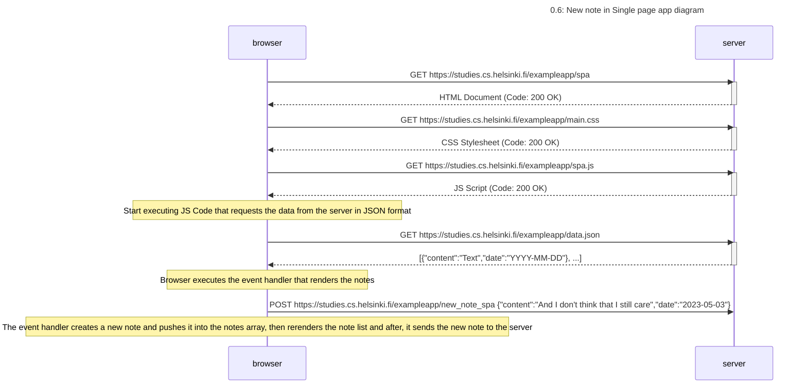

```mermaid
sequenceDiagram
    Title: 0.6: New note in Single page app diagram
    
    participant browser
    participant server

    browser->>server: GET https://studies.cs.helsinki.fi/exampleapp/spa
    activate server
    server-->>browser: HTML Document (Code: 200 OK)
    deactivate server

    browser->>server: GET https://studies.cs.helsinki.fi/exampleapp/main.css
    activate server
    server-->>browser: CSS Stylesheet (Code: 200 OK)
    deactivate server

    browser->>server: GET https://studies.cs.helsinki.fi/exampleapp/spa.js
    activate server
    server-->>browser: JS Script (Code: 200 OK)
    deactivate server

    note over browser: Start executing JS Code that requests the data from the server in JSON format
    browser->>server: GET https://studies.cs.helsinki.fi/exampleapp/data.json
    activate server
    server-->>browser: [{"content":"Text","date":"YYYY-MM-DD"}, ...]
    deactivate server

    note over browser: Browser executes the event handler that renders the notes
    browser->>server: POST https://studies.cs.helsinki.fi/exampleapp/new_note_spa {"content":"And I don't think that I still care","date":"2023-05-03"}

    note over browser: The event handler creates a new note and pushes it into the notes array, then rerenders the note list and after, it sends the new note to the server
```